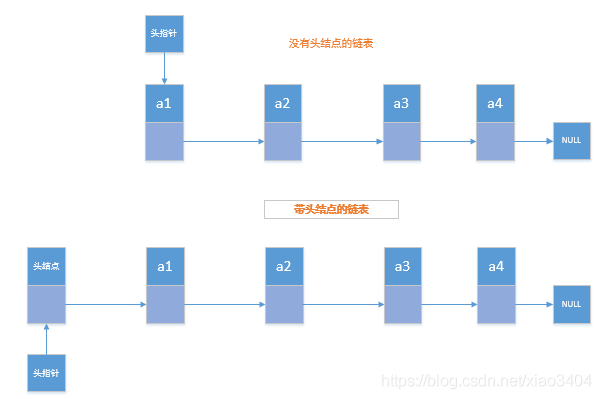

技巧：
一、使用哨兵简化实现难度
head = { value: null, next: a}

二、重点留意边界条件处理
我经常用来检查链表代码是否正确的边界条件有这样几个：
如果链表为空时，代码是否能正常工作？
如果链表只包含一个结点时，代码是否能正常工作？
如果链表只包含两个结点时，代码是否能正常工作？
代码逻辑在处理头结点和尾结点的时候，是否能正常工作？
三、画图

5个常见链表操作：
单链表反转 
链表中环的检测
两个有序的链表合并
删除链表倒数第 n 个结点
求链表的中间结点